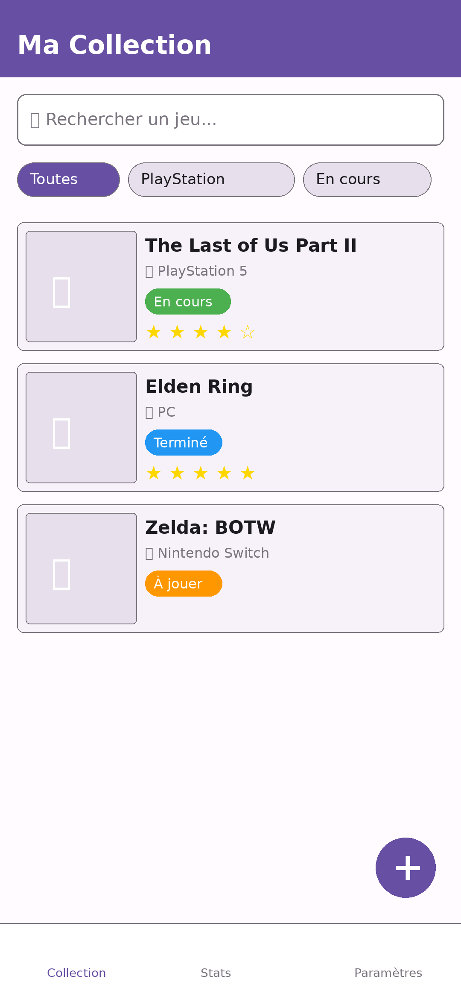
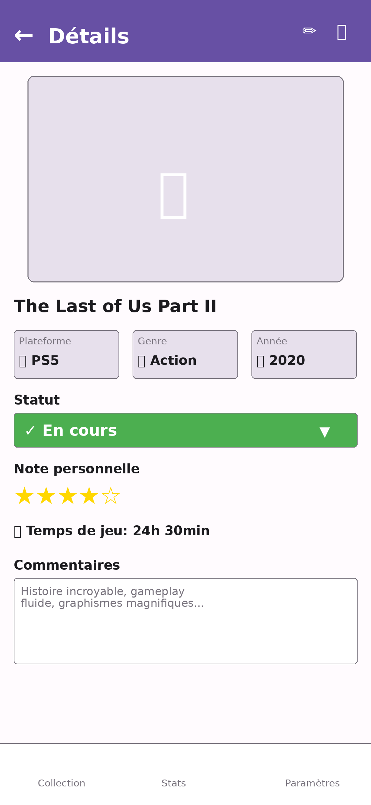
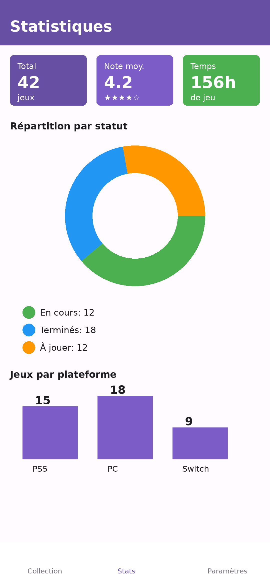
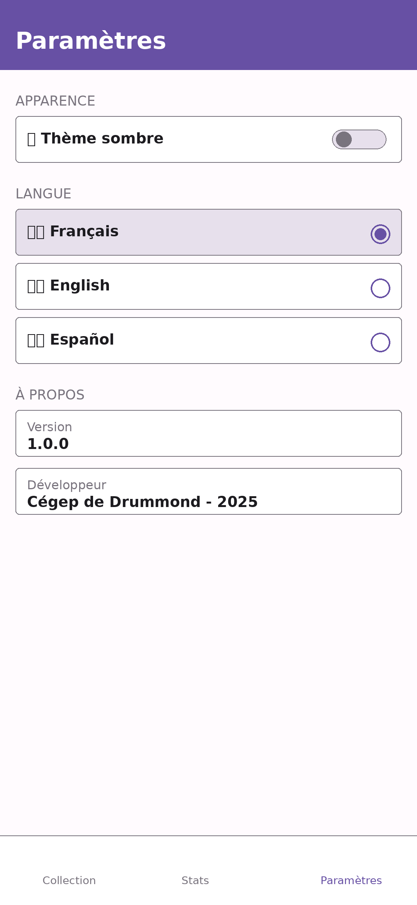

# GameCollection

## Informations sur l'équipe

**Étudiant :Moussa Kane
**Numéro DA :2433952

## Description de l'application

**GameCollection** est une application Android de gestion de collection de jeux vidéo développée avec Jetpack Compose et Material 3. Elle permet aux joueurs de cataloguer, organiser et suivre leur bibliothèque de jeux personnelle.

### Fonctionnalités principales

L'application offre les fonctionnalités suivantes :

- **Gestion de collection** : Ajout, modification et suppression de jeux vidéo dans votre bibliothèque personnelle
- **Catalogage détaillé** : Chaque jeu contient des informations complètes (titre, plateforme, genre, année de sortie, statut, note personnelle, temps de jeu, commentaires)
- **Statuts de jeu** : Organiser les jeux selon leur progression (À jouer, En cours, Terminé, Abandonné)
- **Système de notation** : Évaluer chaque jeu avec une note personnelle
- **Recherche et filtres** : Trouver rapidement des jeux par titre, plateforme, genre ou statut
- **Statistiques visuelles** : Visualiser sa collection avec des graphiques (répartition par statut, plateforme, genre, temps de jeu total)
- **Support multilingue** : Interface disponible en français, anglais et espagnol
- **Thèmes personnalisables** : Basculer entre mode clair et mode sombre
- **Persistance des données** : Sauvegarde automatique de la collection entre les sessions

### Architecture et navigation

L'application est organisée autour de 4 écrans principaux :

1. **Écran Collection** : Affichage de tous les jeux en liste ou grille avec recherche et filtres
2. **Écran Détails** : Consultation et modification des informations complètes d'un jeu
3. **Écran Statistiques** : Visualisation des données de la collection sous forme de graphiques
4. **Écran Paramètres** : Configuration de la langue et du thème de l'application

La navigation se fait via une barre de navigation inférieure (Bottom Navigation Bar) permettant d'accéder rapidement aux sections principales.

## Maquettes de l'interface

### Écran Collection

*Vue principale avec la liste des jeux, recherche et filtres*

### Écran Détails

*Informations complètes d'un jeu sélectionné*

### Écran Statistiques

*Visualisation des données de la collection*

### Écran Paramètres

*Configuration de la langue et du thème*

## Technologies utilisées

- **Langage** : Kotlin
- **Framework UI** : Jetpack Compose
- **Design** : Material 3
- **Navigation** : Compose Navigation
- **Gestion d'état** : remember, rememberSaveable, mutableStateOf
- **Internationalisation** : Ressources strings multilingues
